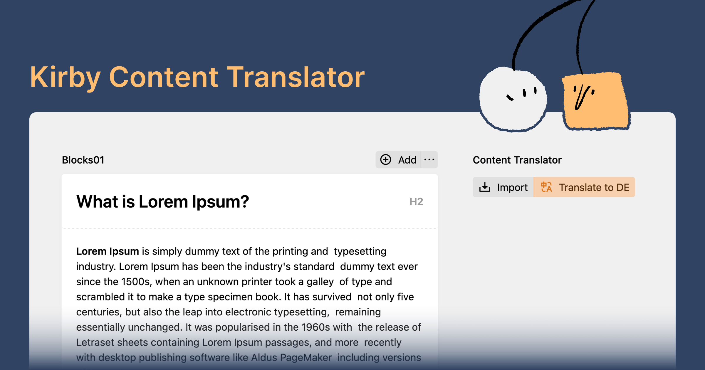

# This Project Moved to [kirby.tools/content-translator](https://kirby.tools/content-translator)

> [!NOTE]
> This plugin has evolved into [Kirby Content Translator v2](https://kirby.tools/content-translator) and is now available as a paid solution.
>
> While you can still use the v1 of the plugin, it will no longer receive updates or support. We recommend upgrading to the new Kirby Content Translator (Pro) plugin to benefit from the latest features and improvements, such as better support for nested fields and the PHP API.

## New Features in v2

- 🤿 Recursive translation of nested structures, objects, blocks, etc.
- 👩‍🔧 [Programmatic API for developers](https://kirby.tools/docs/content-translator/php-api) – integrate content translation in CLI commands and all your custom workflows
- 🧩 Sensible defaults and [much simpler configuration](https://kirby.tools/docs/content-translator/configuration)



Below you can find the documentation for the v1 of the plugin.

****

# Kirby Content Translator

Sometimes you may find yourself copying content from Kirby fields to your clipboard, only to paste it into a translation service of your choice. This plugin aims to simplify the translation process by providing a simple interface for translating a model's content (page, file, etc.), while allowing full flexibility in choosing which fields to translate.

With a single click, an editor can:

1. Synchronise content from the default language to the secondary language.
2. Translate content using the DeepL API or a custom translation service.

## Key Features

- 🚌 Supports **writer**, **blocks**, **structure** and many more Kirby fields
- 🧮 Configure which fields should be translated
- 🌐 Translate all fields with one click
- 🌝 Panel buttons
- 🧩 Use DeepL API or custom translation service

## Requirements

- Kirby 4+

Kirby is not free software. However, you can try Kirby and the Starterkit on your local machine or on a test server as long as you need to make sure it is the right tool for your next project. … and when you’re convinced, [buy your license](https://getkirby.com/buy).

## Installation

### Composer

```bash
composer require johannschopplich/kirby-content-translator
```

### Download

Download and copy this repository to `/site/plugins/kirby-content-translator`.

## Getting Started

### DeepL Account

By default, this plugin uses the [DeepL API](https://www.deepl.com) to translate your content. You can use any other translation service by defining a custom translator function (see below).

In order to use the DeepL API, you have to [create an account](https://www.deepl.com/de/pro-api) and [generate an API key](https://www.deepl.com/de/account/summary).

### Panel Section

First, set up the Panel section in one of your blueprints, e.g. a page blueprint and configure the fields that should be synchronised and translated:

- The `syncableFields` key defines the fields that should be copied from the default language to the secondary language when the user is editing content in any language but the default language and clicks the synchronise button.
- The `translatableFields` key defines the fields that should be translated when the user clicks the translate button.

Below is an example configuration with common configuration options:

```yml
sections:
  contentTranslator:
    type: content-translator
    # Define field names which should be synced from the default language to other languages
    syncableFields:
      - text
      - description
      - tags
    # Define field names that should be translated
    translatableFields:
      - text
      - description
```

> [!TIP]
> By default, all built-in Kirby blocks that include a text-like field are pre-configured to be translated. You can override this behaviour by defining your own [`translatableBlocks` configuration](#translatable-blocks).

Finally, store the DeepL API key in your config file:

```php
# /site/config/config.php
return [
    'johannschopplich.content-translator' => [
        // API key for the DeepL free or pro plan
        'DeepL' => [
            'apiKey' => 'abc123…'
        ]
    ]
];
```

## Configuration

The following blueprint configuration options are available for the `content-translator` Panel section:

| Key                           | Type            | Default                                                     | Description                                                                                                                                                                                     |
| ----------------------------- | --------------- | ----------------------------------------------------------- | ----------------------------------------------------------------------------------------------------------------------------------------------------------------------------------------------- |
| `syncableFields`              | Array           | `[]`                                                        | The fields that should be copied from the default language to the secondary language when the user is editing content in any language but the default language.                                 |
| `translatableFields`          | Array           | `[]`                                                        | The fields that should be translated when the user clicks the translate button.                                                                                                                 |
| `translatableStructureFields` | Array           | `[]`                                                        | The fields inside a `structure` field that should be translated. For the `type: structure` field itself, add its blueprint key to the `translatableFields` array.                               |
| `translatableObjectFields`    | Array           | `[]`                                                        | The fields inside an `object` field that should be translated. For the `type: object` field itself, add its blueprint key to the `translatableFields` array.                                    |
| `translatableBlocks`          | Array           | See [`sections.php`](./src/extensions/sections.php#L21-L30) | The block names and their corresponding fields that should be translated when the user clicks the translate button. By default, all Kirby blocks that include a text-like field are translated. |
| `title`                       | Boolean         | `false`                                                     | Whether the title of the model should be synchronised and translated.                                                                                                                           |
| `label`                       | String or Array | See [`translations.php`](./src/extensions/translations.php) | Optionally, you can translate the section label.                                                                                                                                                |
| `confirm`                     | Boolean         | `true`                                                      | Disable the confirmation dialog before either the synchronisation or translation process is started.                                                                                            |

> [!TIP]
> If no `syncableFields` are defined, the button to synchronise content will not be displayed.

### Translatable Blocks

If you create custom Kirby blocks, you probably want to translate their content as well. To do so, you can define the block names and their corresponding fields that should be translated when the user clicks the translate button:

```yml
sections:
  contentTranslator:
    type: content-translator
    # Given the `text` field is of type `blocks`
    translatableFields:
      - text
    # Define the field names inside blocks which should be translated
    translatableBlocks:
      # Example: translate the `alt` and `caption` fields of the `myImage` block
      myImage:
        - alt
        - caption
      # Example: translate the `caption` field of the `myGridCard` block
      myGridCard:
        - caption
```

> [!NOTE]
> The blocks configuration for built-in Kirby blocks is defined in [`sections.php`](./src/extensions/sections.php#L21-L30).

### Translatable Structure Fields

The plugin translates fields within structures. The structures may be part of the current model or a block. For example, if you have a `structure` field with a `text` field inside, you can translate the `text` field by first adding it to the `translatableStructureFields` array:

```yml
translatableStructureFields:
  - text
```

Then, depending on whether the `structure` field is part of the current model or a block, you need to add the key of the `structure` field to the `translatableFields` or `translatableBlocks` array:

```yml
# When your structure is part of the current model:
translatableFields:
  - myStructure

# Or else, if your structure is part of a block:
translatableBlocks:
  myBlockWithStructure:
    - structureInBlock
```

### Translatable Object Fields

The plugin can translate fields within `type: object` fields. The objects may be part of the current model or a block. For example, if you have an `object` field with a `label` field inside, you can translate the `label` field by first adding it to the `translatableObjectFields` array:

```yml
translatableObjectFields:
  - label
```

Then, depending on whether the `object` field is part of the current model or a block, you need to add the key of the `object` field to the `translatableFields` or `translatableBlocks` array:

```yml
# When your object is part of the current model:
translatableFields:
  - myObject

# Or else, if your object is part of a block:
translatableBlocks:
  myBlockWithObject:
    - objectInBlock
```

### Translating the Title

You can enable to synchronise and translate the title of a model by setting the `title` section property to `true`:

```yml
sections:
  contentTranslator:
    type: content-translator
    title: true
```

> [!IMPORTANT]
> Technically speaking, the title is not part of the content of a Kirby model. That's why you can't revert changes made to the title, as opposed to fields. Also, when synchronising content, the title will be overwritten.
> Because of these caveats, have to opt-in to synchronise and translate the title.

### Section Label

Optionally, you can translate the section label by adding a `label` key:

```yml
sections:
  contentTranslator:
    type: content-translator
    # Either use a single label for all languages
    label: Translator
    # Or use language codes for multilingual labels
    # label:
    #   en: Translator
    #   de: Übersetzer
```

### Skip Dialogs Before Synchronising/Translating

To make sure an editor doesn't accidentally synchronise or translate content and thus overwrite existing translations, a confirmation dialog is displayed before the process is started. If you want to skip this dialog, you can set the `confirm` key to `false`:

```yml
sections:
  contentTranslator:
    type: content-translator
    confirm: false
```

### Global Configuration Defaults

Instead of defining the configuration in every blueprint, you can also define global defaults in your config file. This is especially useful if, for example, every page's blocks should be translated the same way.

> [!NOTE]
> Local blueprint configurations will always override global defaults.

```php
# /site/config/config.php
return [
    'johannschopplich.content-translator' => [
        'syncableFields' => ['text', 'description'],
        'translatableFields' => ['text', 'description'],
        'translatableBlocks' => [
            'heading' => ['text'],
            'text' => ['text'],
            'image' => ['alt', 'caption']
        ],
        'confirm' => false
    ]
]
```

### Allow Overwriting Content of the Default Language

With the default plugin configuration, the synchronisation process will only copy content from the default language to secondary languages. If you want to allow overwriting content of the default language, you can set the `allowOverwrite` key to `true`. This will enable you to synchronise content from the secondary language to the default language.

```php
# /site/config/config.php
return [
    'johannschopplich.content-translator' => [
        'allowDefaultLanguageOverwrite' => true
    ]
]
```

### Custom Translator Function

Instead of using the DeepL API, you can define a custom translator callback that accepts the text to be translated, the source language code and the target language code. The plugin expects a string to be returned.

```php
# /site/config/config.php
return [
    'johannschopplich.content-translator' => [
        'translateFn' => function (string $text, string|null $sourceLanguageCode, string $targetLanguageCode): string {
            // Your custom translation logic
            return myCustomTranslateFunction($text, $sourceLanguageCode, $targetLanguageCode);
        }
    ]
];
```

## License

[MIT](./LICENSE) License © 2023-PRESENT [Johann Schopplich](https://github.com/johannschopplich)

[MIT](./LICENSE) License © 2023-PRESENT [Dennis Baum](https://github.com/dennisbaum)
